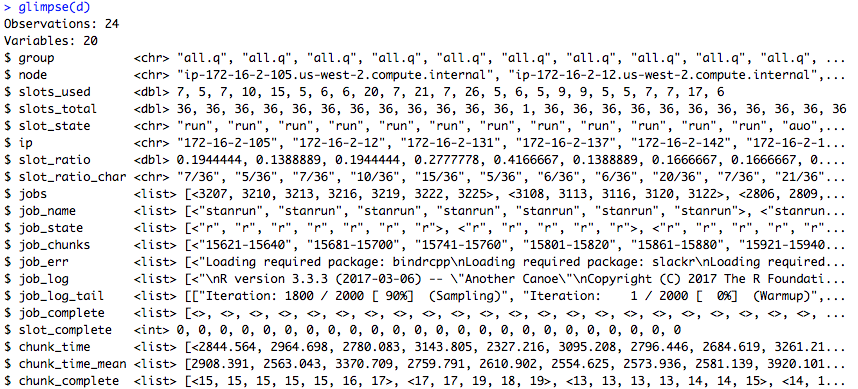
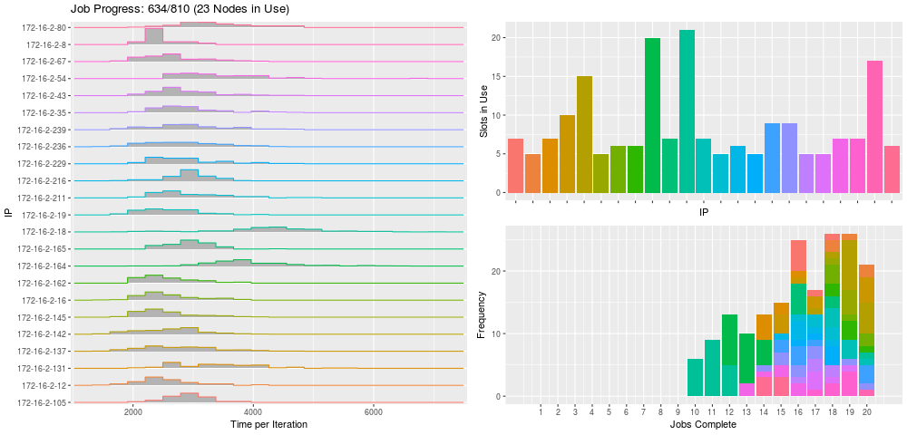

# qibble

Working in a tidy framework to manage jobs on the [Open Grid Scheduler](http://gridscheduler.sourceforge.net/). 

The Open Grid Scheduler/Engine (OGSE) is an open source batch-queuing system, developed and based upon Sun Grid Engine.

This package depends that the OGSE is installed on your system. To check this run from the terminal

```
qconf -sconf
```

This should return current configuration of the sungrid engine if there is one.

## qapply

It is suggested that the R package [qapply](https://bitbucket.org/metrumrg/qapply/src) is installed. The outputs will be more informative with this package and the shiny app will be enabled.


## Installation

```r
remotes::install_github('metrumresearchgroup/qibble')
```

## Basic Usage

A qibble (qstat tibble) object is a tibble with the class qibble

Without `qapply`

```r
qibble()
```

With `qapply`

```r
workDir <- 'Directory where the worker processes will be spawned'
tag <- 'A label for the job and temporary files related to the job'

#same as defined in qapply call

d <- qibble(workDir = workDir,tag = tag)

glimpse(d)
```



```r
plot(d)
```



